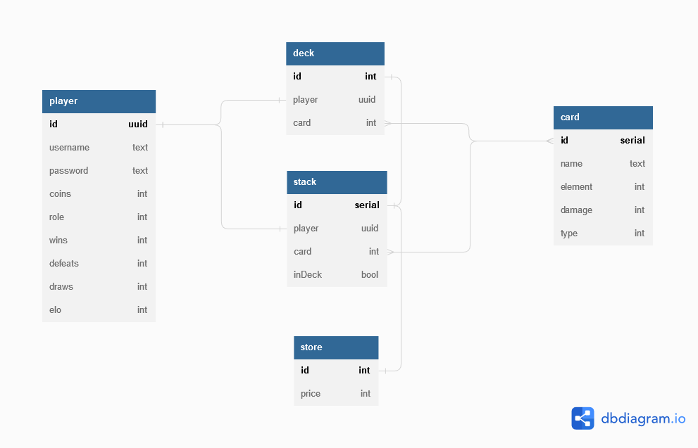

# Monster Trading Card Game 
## Design
The first step for me when I started designing this project was making an ERD for the database. That way I'm able to get a very fast understanding of the scope of the work. Here the ERD of my Database:


After designing and building the database, I built the methods in c# that will access the database.
Next I built a basic Server that can listen to and parse requests.
After that all that was missing were routes that the client could send requests to, which then implement the real functionality of the server and therefor connect the server with the interface Class to the Database.
Additionally I implemented a few helper Classes which help with readabilty and maintainability of the code.

### Battle Design
I designed the battle on the principle of client polling. That means, when a user wants to start a battle, he sends a request to the server and then get listed into a queue and gets as response that he is waiting for other users. Then if a second user wants to battle, the battle starts and the second user gets the result of the battle as a response.
When the first user wants to know the result, he has to send a second request.

## Trading Desin
I implemented trading only in the form of card for coin. Trading cards in the way it was described in the MonsterTradingCards_exercise.pdf just didn't make sense to me. So I chose to implement it as a feature that is very common in these types of games.

I know that in a real world scenario that wouldn't be an option, as I can't just change requirement from the client just because I don't like them. So, I of course would never do that in real live. But since this is an exercise with the goal of getting us more familiar with many important principals of programming, I don't see how this change of mine stands in the way of the original goal of the whole project.

## Solutions
### Routes
I opted to outsource the routes into different classes and then use delegates to call them via a dictionary. Here is how that looks in code:
```cs
private void addRoutes() {
    routes.Add("GET", new Dictionary<string, Action<TcpClient, JObject, User>> {
        ["/stack"] = getRequestHandlers.getStack,
        ["/deck"] = getRequestHandlers.getDeck,
        ["/user"] = getRequestHandlers.getUser,
        ["/store"] = getRequestHandlers.getStoreOffers,
        ["/scoreboard"] = getRequestHandlers.getScoreboard
    });
    routes.Add("POST", new Dictionary<string, Action<TcpClient, JObject, User>> {
        ["/login"] = postRequestHandlers.login,
        ["/user"] = postRequestHandlers.addUser,
        ["/card"] = postRequestHandlers.addCard,
        ["/deck"] = postRequestHandlers.updateDeck,
        ["/game"] = postRequestHandlers.startGame,
        ["/transactions/package"] = postRequestHandlers.buyPackage,
        ["/transactions/addOffer"] = postRequestHandlers.addOfferToStore,
        ["/transactions/buyOffer"] = postRequestHandlers.buyOfferFromStore
    });
    routes.Add("PUT", new Dictionary<string, Action<TcpClient, JObject, User>> {
        ["/user"] = putRequestHandler.updateUser
    });
}
```
Every route is an entry into a dictionary according to the method and for every method there is a seperate utility class to handle it. And this is how the delegate works:
```cs
if (routes.TryGetValue(request.method, out var methodSpecificRoutes)) {
    if (methodSpecificRoutes.TryGetValue(request.resource, out var handler)) {
        handler(client, request.body, currentUser); // call the method from the dict
    } else {
        errMsg = "resource not found";
        RequestHandler.writeStructuredResponse(client, HttpStatusCode.NotFound, errMsg);
        return;
    }
} else {
    errMsg = "resource not found";
    RequestHandler.writeStructuredResponse(client, HttpStatusCode.NotFound, errMsg);
    return;
}
```
### Tests
I used the Framework NUnit for testing and the framework Moq to mock dependencies. Here is an example of Moq from the ``TestMethod`` gameTest_02():
```cs
// simulating two random users
Guid user1 = Guid.NewGuid();
Guid user2 = Guid.NewGuid();

// creating the mocked object
Mock<Database> mockedDB = new();
// defining the behaviour of the member function getDeck(Guid)
mockedDB.Setup(x => x.getDeck(It.IsAny<Guid>())).Returns((Guid id) => {
    List<Tuple<int, Card>>? deck = new();
    if (id == user1) {
        for (int j = 0; j < 4; j++)
            deck.Add(Tuple.Create<int, Card>(j, new(1, "NormalKraken", Element.NORMAL, 12, Type.KRAKEN)));
        return deck;
    } else {
        for (int j = 0; j < 4; j++)
            deck.Add(Tuple.Create<int, Card>(j, new(1, "FireSpell", Element.FIRE, 12, Type.SPELL)));
        return deck;
    }
});
```

## Lessons learned
This was the first time for me to at all work with c# so there were many lessons I learned while working on this project.
But probably one of the biggest lessons I learned only after I was almost done with the project, was how much automated testing could have helped. I know that, that is something especially new programmers often get to hear but it really is something else to experience it first hand. It just happens way too often that some small change or refactoring in one place of the program breaks something else and it then takes forever to find out. So for the next bigger project I'll definitly write automated tests a lot earlier than I did this time.

## Unit testing decisions
I picked out the most crucial and also testable componands. So for example I don't have any unit tests for the Database class and the server class, because that would have been too much work with all those dependencies. Unfortunatly that only really left the gameHandler class to be a viable candidate for unit tests.

## Unique Feature
My unique feature in this project, apart from totally changing the api and then having to write my own end-to-end test for it (which was a lot more work than I would have expected), was a relatively small python client for the server-application.

## Tracked Time
I didn't track my time. But it was a lot.

## Git
https://github.com/Dovahkiin02/FH_swen01_MonsterTradingCardGame
